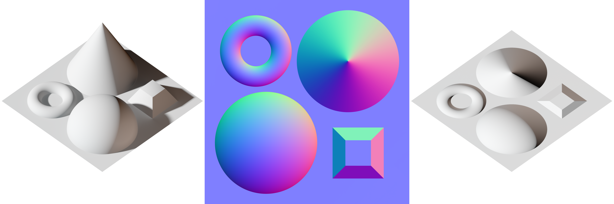

# TritonHacks Python-Hard Challenge: NumPy and MediaPipe

Earth is invaded by aliens; therefore, you (the programmer) have to evacuate earth on a spaceship. The spaceship will 
have a camera that will take pictures once in a while when you are in space. For each image taken, you have to perform 
a series of tasks to decode the image to see if there is an alien among us.

## Introduction

Good job, you have spoiled many evil plans from the aliens, but they will not stand there and do nothing. 
Recently, the angry aliens have started using pictures to trick our algorithms! To combat this and ensure the human’s 
safety, you will have to distinguish between pictures of humans (they are aliens in disguise!) and real humans passing 
in front of the security cameras.

### Challenge

Using NumPy’s powerful image manipulation tools, you will separate objects with the background and extract the normal 
map from pictures the security cameras took in order to obtain depth information for our computers to distinguish 
between pictures of humans (the aliens are using them as face-covers) and real humans. You also need to use Mediapipe’s 
segmentation tools and some OpenCV libraries to get the best result.
  
## Requirements:

You need python to do this, hopefully you have that installed, if not, visit python's website at 
[https://www.python.org](https://www.python.org)

#### Important: Mediapipe currently only supports up to Python 3.10, please do not use Python 3.11 for this challenge

<h4>Make sure to have pip installed with python, pip is the package manager for python and is very useful for managing 
your dependencies</h4>

To install pip, run:

- On Linux: `python -m ensurepip --upgrade`
- On Windows: `py -m ensurepip --upgrade`
- On MacOS: `python -m ensurepip --upgrade`

Make sure to keep pip updated, to do this, run: 
`pip install --upgrade pip`

In your starter kit there should be a few demo images, make sure they are in the same 
directory as your code

### Dependencies

You will need NumPy, Mediapipe, OpenCV, and MatplotLib for this challenge

We provide a `requirement.txt` file for you to quickly install all the dependencies, to install, navigate to the 
directory and enter:

`pip install -r requirements.txt`

If you would like to install them individually, run:

- For NumPy: `pip install numpy==1.24.2`
- For Mediapipe: `pip install mediapipe==0.9.3.0`
- For OpenCV: `pip install opencv-python==4.7.0.72`
- For MatplotLib: `pip install matplotlib==3.7.1`

<h6> Note: OpenCV's Python port and Matplotlib currently do not support devices with Apple Silicon. </h6>

## Part 1: Setting Up

### Dependencies

Create a file `<give it a name>.py` in your project directory, make sure that the images that you use are in the same 
directory as your code. Then, simply import the dependencies we need

```python
import numpy as np
import mediapipe as mp
import cv2
from matplotlib import pyplot as plt
```

Then use OpenCV's `imread()` function to read the image into a variable

```python
img = cv2.imread('image1.jpg')
```

## Part 2: Background Removal

To better read the image, we need to identify and remove the background of our objects.

### Set a Background

First we need a background image to put the person on once we removed the background, we can just simply load a black 
photo and resize it to use as our background

```python
background = cv2.imread('bg.jpg')
```

NumPy's `shape` tool allows us to read the dimensions and channels our image have, to use it

```python
height, width, channel = img.shape
```

Note: the variables have to be placed in this order since our image is loaded into the variable as an array, and 
declaring the variables in this order is essentially the same as writing:

```python
height  = img.shape[0]
width   = img.shape[1]
channel = img.shape[2]
```

We can then use OpenCV to resize our background picture to the same dimension as the image we want to process

```python
background = cv2.resize(background, (width, height))
```

### Object Detection

To detect the person (or alien) in the picture, Google's Mediapipe library provides `selfie_segmentation` class for 
us to easily do that. Note that this only works on selfies and generally objects with clear background separation, if 
you want to separate other things, you might want to look into 
[histogram-based segmentation](https://scipy-lectures.org/advanced/image_processing/#segmentation) with numpy

First we need to create a new instance of `selfie_segmentation` because it is an object, to do so:

```python
mpSelfieSegmentation = mp.solutions.selfie_segmentation
```

Now we can use the `SelfieSegmentation()` function to create a new segmentation that we can use

```python
segmentation = mpSelfieSegmentation.SelfieSegmentation(model_selection=1)
```

Note that The (mode_selection) value is set to `1` if you want to use the landscape model. For general model, the value 
should be set to `0`. You can read more about it 
[here](https://github.com/google/mediapipe/blob/master/docs/solutions/selfie_segmentation.md#models)

#### Convert Image into RGB

Note that the image right now is in `BRG` colorspace. In this form, we cannot process or display it.

We need to convert the image to `RGB` from `BRG`. OpenCV contains the function `cvtColor(<input>, <conversion_code>)` 
to convert the images into another color space

The function accepts array as the input, and because our image is loaded with the `imread()` function, it is already a 
matrix (a `cv::Mat` type is essentially a list of matrices), we can use it directly in the function without conversion

The conversion codes are also included inside the OpenCV library 
[here](https://docs.opencv.org/4.7.0/d8/d01/group__imgproc__color__conversions.html), each corresponding to what you 
want to convert to and from. In this case, we will use the code `COLOR_BGR2RGB`, as it converts `BGR` images into `RGB`

It should look something like this:

```python
imgRGB = cv2.cvtColor(img, cv2.COLOR_BGR2RGB)
```

### Segmenting and displaying

Now we have the image in the correct colorspace, we can use the `process()` function to segment the image

```python
results = segmentation.process(imgRGB)
```

We now want to make it into a mask, so we can mask it onto the background image

```python
mask = results.segmentation_mask
```

To adjust the cutoff value, we want to use numpy's `stack()` function on it

```python
condition = np.stack((results.segmentation_mask,) * 3, axis=-1) > 1e-5
```

It returns true or false where the condition applies in the mask, and you can adjust the value `1e-5` (which just means 
$1x10^-5$) to adjust how much background you want to let in

For example, if the segmentation cuts too much into your object, you can decrease it to `1e-10`. Note that the value is 
logarithmic, which means that the more you change the value, the less of an effect that change will make

Now we just have to combine it with our background and plot it to show the image, to do so, we use the `where()` 
function in numpy's library:

```python
output_image = np.where(condition, img, background)
```

And then we plot it with

```python
plt.imshow(output_image)
plt.show()
```

You can also save the image by using

```python
cv2.imwrite("output.jpg", output_image)
```

## Part 3: Generating Normal Map

A normal map is essentially an image of depth information, it tells the computer how deep a feature on an image is, so 
the computer can make it seem 3-dimensional when rendering it

<p style="text-align:center;"></p>

<h6 style="text-align:center;"> Normal map when rendered </h6>

You can also read more about normal maps [here](https://en.wikipedia.org/wiki/Normal_mapping) (yep it's just the 
wikipedia page of it)

To generate the normal map, we first need to convert the image back into `BRG`

```python
imgGray = cv2.cvtColor(output_image, cv2.COLOR_RGB2BGR)
```

Then we need to convert the image array into the `float64` (64 bit float) type so we can process it:

```python
imageFloat = imgGray.astype("float64")
```

We can now use the `array()` function inside NumPy's library to convert the image to a floar32 2-Dimensional image 
array for process

```python
normals = np.array(imageFloat, dtype="float32")
```

Because Python is very slow and the algorith is also single-threaded, it will take a while to complete, we should 
probably print something in the terminal to let yourself know that the program has started to process the image

```python
print("Processing")
```

Then we can apply these 2 for loops to process the image.

```python
for i in range(1, width - 1):
    for j in range(1, height - 1):
        t = np.array([i, j - 1, imageFloat[j - 1, i, 0]], dtype="float64")
        f = np.array([i - 1, j, imageFloat[j, i - 1, 0]], dtype="float64")
        c = np.array([i, j, imageFloat[j, i, 0]], dtype="float64")
        d = np.cross(f - c, t - c)
        n = d / np.sqrt((np.sum(d ** 2)))
        normals[j, i, :] = n
```

This will convert each pixel in the image array in a set of formulas to generate the dept information based on shading. 

Usually this works better on back and white images with only objects' shading and no texture, but in this case the 
generated image is good enough for our onboard computer

After the loops finish running, we can print out something to let us know that it has done processing

```python
print("done")
```

We now want to time our normal by `255` to correct the colors, since we had it in `float64`, and now we want it back to 
the sandard color range (0 to 255)

```python
normals *= 255
```

And then finally we can save the image as a file

```python
cv2.imwrite("normal.jpg", normals)
```

You can see that the image is now in a weird image patter that only computers will be able to understand. But now our 
onboard computer will be able to process and identify the aliens!
