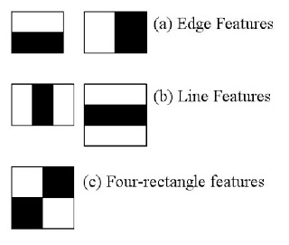

# TritonHacks Python-Hard Challenge: OpenCV

## Introduction

The engineers aboard the spaceship have created the AVHC (stands for A Very Huge Camera), a super high-resolution 
camera! The problem is the images are simply too big to be processed by the algorithms on your computer in real time.

<p style="text-align:center;"></p>

### Challenge:

Using OpenCV’s various methods of feature detection, you will identify the features that are present in the photos that 
the AVHC took. You will then extract these features and generate separate smaller images that your computer can handle.

Through this challenge, you will learn about haar cascade and how to use some of the libraries in OpenCV's python port

## Requirements:

You need python to do this, hopefully you have that installed, if not, visit python's website at 
[https://www.python.org](https://www.python.org)

<h4>Make sure to have pip installed with python, pip is the package manager for python and is very useful for managing 
your dependencies</h4>

To install pip, run:

- On Linux: `python -m ensurepip --upgrade`
- On Windows: `py -m ensurepip --upgrade`
- On MacOS: `python -m ensurepip --upgrade`

Make sure to keep pip updated, to do this, run: 
`pip install --upgrade pip`

In your starter kit there should be a few demo images and two haar cascade `.xml` files, make sure they are in the same 
directory as your code

### Dependencies

You will need OpenCV library and MatplotLib library for this challenge

We provide a `requirement.txt` file for you to quickly install all the dependencies, to install, navigate to the 
directory and enter:

`pip install -r requirements.txt`

If you would like to install them individually, run:

- For OpenCV: `pip install opencv-python==4.7.0.72`
- For MatplotLib: `pip install matplotlib==3.7.1`

<h6> Note: OpenCV's Python port and Matplotlib currently does not support devices with Apple Silicon. </h6>

## Getting Started:

### Part 1: Setting Up

#### Dependencies

Create a file `<give it a name>.py` in your project directory, _make sure that the images that you use and the `.xml` 
files are in the same directory_

Import the libraries to use them, for OpenCV, the library name is just called `cv2`. We only need the `pyplot` 
submodule from MatplotLib, so you could import that by itself:

```python
import cv2
from matplotlib import pyplot
```

#### Getting the image

OpenCV provides the function `imread()` for retrieving images. To use this, create a variable and assign its 
value as the image. For example:

```python
image = cv2.imread("image.jpg")
```

You can also use absolute path to the image here, for example, `/home/UserName/Documents/projectDir/image.jpg` is a 
valid path

You can then display this image using the `imshow()` function in **pyplot**. For example:

```python
pyplot.imshow(image)
```

### Part 2: Haar Cascade

#### What is Haar Cascade

Harr Cascade is a machine learning based approach to object detection, it was first proposed by Paul Viola and Michael 
Jones in 2001. The main idea is essentially to analyse pictures using Haar-like features and finding the patterns behind.

<p style="text-align:center;"></p>

<h6 style="text-align:center;"> Haar-like features </h6>

Using machine learning on a very large sample size of the picture of a thing, we could condense these patterns and 
generate a model where we could roughly detect that object in a photo.

<p style="text-align:center;"></p>

<h6 style="text-align:center;"> Haar-like features analysing eyes </h6>


The `.xml` files that we provided are the already-trained haar cascade models of:

- Human Faces: `face_data.xml`
- Stop Signs: `stop_data.xml`

OpenCV provides more pre-trained models [here](https://github.com/opencv/opencv/tree/master/data/haarcascades) 
if you are interested to run object recognition on more things

#### Using Haar Cascade in your code

OpenCV's [CascadeClassifier](https://docs.opencv.org/4.7.0/d1/de5/classcv_1_1CascadeClassifier.html) class is using for 
object detection with haar cascades. To load a `.xml` file as a variable, use the `CascadeClassifier()` function:

```python
xml_data = cv2.CascadeClassifier('data.xml')
```

