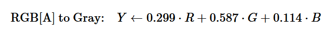
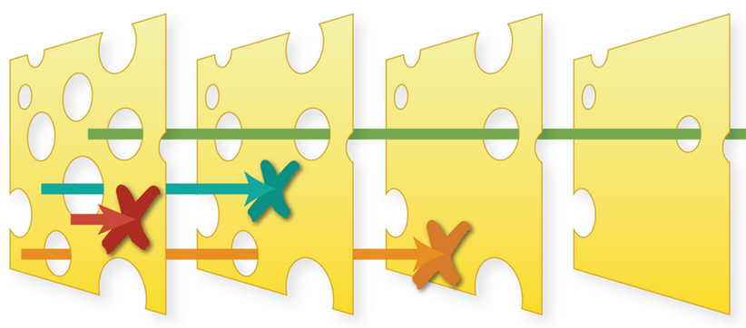
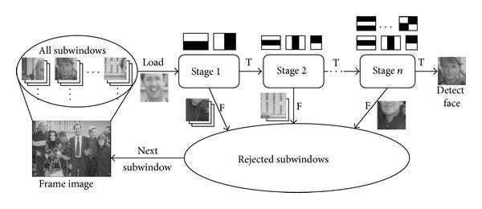

# TritonHacks Python-Hard Challenge: OpenCV

Earth is invaded by aliens; therefore, you (the programmer) have to evacuate earth on a spaceship. The spaceship will 
have a camera that will take pictures once in a while when you are in space. For each image taken, you have to perform 
a series of tasks to decode the image to see if there is an alien among us.

## Introduction

The engineers aboard the spaceship have created the AVHC (stands for A Very Huge Camera), a super high-resolution 
camera! The problem is the images are simply too big to be processed by the algorithms on your computer in real time.

<p style="text-align:center;"></p>

### Challenge:

Using OpenCV’s various methods of feature detection, you will identify the features that are present in the photos that 
the AVHC took. You will then extract these features and plot out smaller regions for your computer to handle.

Through this challenge, you will learn about haar cascade and how to use some of the libraries in OpenCV's python port

<h3> Important: The code shown below are just the general guidance on how your code should look, but variable names and 
other things have been altered, so your program will not work if you just copy and paste everything! </h3>

## Requirements:

You need python to do this, hopefully you have that installed, if not, visit python's website at 
[https://www.python.org](https://www.python.org)

<h4>Make sure to have pip installed with python, pip is the package manager for python and is very useful for managing 
your dependencies</h4>

To install pip, run:

- On Linux: `python -m ensurepip --upgrade`
- On Windows: `py -m ensurepip --upgrade`
- On MacOS: `python -m ensurepip --upgrade`

Make sure to keep pip updated, to do this, run: 
`pip install --upgrade pip`

In your starter kit there should be a few demo images and two haar cascade `.xml` files, make sure they are in the same 
directory as your code

### Dependencies

You will need OpenCV library and MatplotLib library for this challenge

We provide a `requirement.txt` file for you to quickly install all the dependencies, to install, navigate to the 
directory and enter:

`pip install -r requirements.txt`

If you would like to install them individually, run:

- For OpenCV: `pip install opencv-python==4.7.0.72`
- For MatplotLib: `pip install matplotlib==3.7.1`

<h6> Note: OpenCV's Python port and Matplotlib currently do not support devices with Apple Silicon. </h6>

## Part 1: Setting Up

### Dependencies

Create a file `<give it a name>.py` in your project directory, _make sure that the images that you use and the `.xml` 
files are in the same directory_

Import the libraries to use them, for OpenCV, the library name is just called `cv2`. We only need the `pyplot` 
submodule from MatplotLib, so you could import that by itself:

```python
import cv2
from matplotlib import pyplot
```

### Getting the image

OpenCV provides the function `imread(<path_to_image>)` for retrieving images. To use this, create a variable and assign 
its value as the image. For example:

```python
variable = cv2.imread("image.jpg")
```

<h6> Note that the function has cv::Mat return type, meaning that the variable here is converted into a matrix of the 
image </h6>

You can also use absolute path to the image here, for example, `/home/UserName/Documents/projectDir/image.jpg` is a 
valid path

You can then display this image using the `imshow(<image_variable>)` function in **pyplot**. For example:

```python
pyplot.imshow(variable)
pyplot.show()
```

Note how the image looks a little weird with a few colors distorted. This is because the image contained in the 
variable is in `BGR` colorspace and your monitor displays images in the `RGB` colorspace. We will convert them later to 
properly display the image

## Part 2: Haar Cascade

### What is Haar Cascade

Harr Cascade is a machine learning based approach to object detection, it was first proposed by Paul Viola and Michael 
Jones in 2001. The main idea is essentially to analyse pictures using Haar-like features and finding the patterns behind.

<p style="text-align:center;"></p>

<h6 style="text-align:center;"> Haar-like features </h6>

Using machine learning on a very large sample size of the picture of a thing, we could condense these patterns and 
generate a model where we could roughly detect that object in a photo.

<p style="text-align:center;"></p>

<h6 style="text-align:center;"> Haar-like features analysing eyes </h6>


The `.xml` files that we provided are the already-trained haar cascade models of:

- Human Faces: `face_data.xml`
- Stop Signs: `stop_data.xml`

OpenCV provides more pre-trained models [here](https://github.com/opencv/opencv/tree/master/data/haarcascades) 
if you are interested to run object recognition on more things

### Load Haar Cascade into your code

OpenCV's [CascadeClassifier](https://docs.opencv.org/4.7.0/d1/de5/classcv_1_1CascadeClassifier.html) class is using for 
object detection with haar cascades. To load a `.xml` file as a variable, use the `CascadeClassifier()` function:

```python
variable = cv2.CascadeClassifier('data.xml')
```

<h6> Note that because the method CascadeClassifier has the same name as the class it is in, we do not have to call 
its class again to use it </h6>

## Part 3: Creating Functions for Processing

Let's create a new class to process the image, you can create it directly in your main file, or create a new file and 
import the class later

```python
class ExampleClass:
```

We need to have a few functions in this class:

- A function to return the image in greyscale (black and white) so it can be processing with haar cascade
- A function to return the image in color for our eyes
- A function to process the image with the haar cascade data

Based on these functions, we know that we need to have a few variables when initialising our class, including:

- Self
- The image (the variable that contains the image to be processed)
- The data (the variable that contains the `.xml` file)

As a reminder, the `__init__` function is created as:

```python
def __init__(self, variable1, variable2, variable3):
    self.variable1 = variable1
    self.variable2 = variable2
    self.variable3 = variable3
```

These variables can then be used in all of our functions that are inside the class

### Convert To Greyscale

Let's creat the function to convert image into greyscale first. OpenCV contains the function 
`cvtColor(<input>, <conversion_code>)` to convert the images into another color space

The function accepts array as the input, and because our image is loaded with the `imread()` function, it is already a 
matrix (a `cv::Mat` type is essentially a list of matrices), we can use it directly in the function without conversion

The conversion codes are also included inside the OpenCV library 
[here](https://docs.opencv.org/4.7.0/d8/d01/group__imgproc__color__conversions.html), each corresponding to what you 
want to convert to and from. In this case, we will use the code `COLOR_BGR2GRAY`, as it converts BGR and RGB into 
greyscale

It does this by removing the alpha channel from the image and reversing the channel order: 
`RGB[A] to Gray: Y ← 0.299 ⋅ R + 0.587 ⋅ G + 0.114 ⋅ B`

<p style="text-align:center;"> GREY" width=500 /></p>

Your function declaration should look something like this:

```python
def function(self):
    return cv2.cvtColor(self.imageVariable, cv2.COLOR_BGR2GRAY)
```

### ConvertToColor

Here we will convert the image from `BGR` to `RGB` so it can be displayed properly. The function should look very 
similar to the previous one, except with a different code to convert it into another colorspace

Give it a try on finding the correct code from the list 
[here](https://docs.opencv.org/4.7.0/d8/d01/group__imgproc__color__conversions.html)

<h6> Hint: You are converting from RGB to BGR color space without the alpha channel </h6>

Your function declaration should look something like this:

```python
def function(self):
    return cv2.cvtColor(self.imageVariable, cv2.FIND_THE_CODE)
```

<h6> Hint: Remember to name your functions differently!</h6>

### Processing the Image

Here we will creat the function that processes the image with the cascade classifier. We also need an extra input 
variable here as the minimum scale of detection

Haar Cascade works in a swiss cheese model: for each image passed through it, multiple Haar-like features have to be 
satisfied in order for that image to pass.

<p style="text-align:center;"></p>

<h6 style="text-align:center;"> The Swiss Cheese Model </h6>

In this sense, the model works sort of like a filter that filters out things that do not fit a pattern.

#### Subdivisioning

<p style="text-align:center;"></p>

<h6 style="text-align:center;"> The Process </h6>

You can see here how the photos have to satisfy more and more Haar-like features in each stage in order to pass

We will use the `detectMultiScale(<input>, <minimum_size>)` function within the `CascadeClassifier` class inside 
OpenCV's library. Here, the input will be the greyscale image, so we will utilize the function that we just created to 
do that.

Because we are trying to detect multiple objects in one photo, we have to separate it into multiple subdivisions (or 
subwindws) and run them through the process one by one. Luckily, the `detectMultiScale()` function already does that 
for us, and will return to us a vector of rectangles as the coordinates of the passed sections.

The minimum scale would be a dimension in pixes for each subdivision so that the function doesn't keep running forever 
(for example, 100x100 pixels would be `minSize=(100, 100)`)

Because the `detectMultiScale()` function is in the `CascadeClassifier` class, we will use it on a variable that is a 
`CascadeClassifier` (which is `self.variable`, for whichever variable that you decided to load your `.xml` file into)

```python
def process(self, minimumSize):
    return self.variable.detectMultiScale(self.your_function_for_greyscale(), minSize=(minimumSize, minimumSize))
```

This should be the last function that you will need in your class for now, you can expand it later

## Part 4: Processing the Image

Now let's head back to our main program file. If you created your class in another file, simply import it by:

```python
from fileName import YourClassName
```

<h6> Note that the file name when importing should not have the .py in it. For example, to import helloworld.py, you 
should use helloworld when importing</h6>

### Creating Variables

First, we need a variable as the minimum size, you can adjust this to fine tune later

```python
# manually adjust depending on picture size
minimumSize = 100
```

#### Note: Different pictures would have different values for `minumumSize` as the resolutions are different

Then we will create a new instance of our class, note that you should pass in the image and the .xml here now

```python
class = className(variable1, variable2)
```

We would also want to convert our image into `RGB` so it could be displayed properly, this will come in handy later

```python
image = class.function_to_get_rgb()
```

### Running the Function

Because our function returns a vector of rectangles, we can simply assign it to a variable as we run it: 

```python
rectangles = class.process(minimumSize)
```

### Visualizing

To visualize our findings, we can draw the rectangles on the photo 

First, make sure that our vector is not empty (or it would give use an error). We can use the built in `len()` function 
for that:

```python
if len(rectangles) != 0:
```

Then inside that if loop, we would want to draw a rectangle for each rectangle in the vector, we can use a `for` loop 
for this:

```python
    for (x, y, width, height) in rectangles:
```

Where `x` and `y` are the coordinates, and `width` and `height` are the... well, width and height of each rectangle

Finally, we can draw the rectangles using the `rectangle(<image>, <start_point>, <end_point>, <color>, <thickness>)` 
function in OpenCV's library:

```python
        cv2.rectangle(image, (x, y), (x + height, y + width), (0, 255, 0), 5)
```

Where the `image` is the `RGB` version of the picture we just created

`(0, 255, 0)` would be the color of the rectangle in `(R, G, B)`, and `5` is the thickness. You can also tweak these 
values to how you want them

Combined, your completed loop should look something like this:

```python
if len(rectangles) != 0:
    for (x, y, width, height) in rectangles:
        cv2.rectangle(image, (x, y), (x + height, y + width), (0, 255, 0), 5)
```

#### Showing the plot

If you still have the `pyplot.imshow(variable)` from before, please remove that, as this will mess with plotting

To plot the completed image, add:

```python
pyplot.imshow(image)
```

in the end using the function from MatplotLib, will `imshow(image)` will show the image with the rectangles plotted

Finally, use the `show()` function if you haven't already

```python
pyplot.show()
```

This will show the plot

## Part 5: Wrap Up

### Try Your Own Images!

You can try to process the images that we provide by passing the paths to the images. You can also try this on your own 
images, or even use with different `.xml` models!

OpenCV provides more pre-trained models [here](https://github.com/opencv/opencv/tree/master/data/haarcascades) 
if you are interested

### Making your own models

Generating your own .xml models can be challenging, but if you are interested, here is a tutorial on how: 
[https://pythonprogramming.net/haar-cascade-object-detection-python-opencv-tutorial/](https://pythonprogramming.net/haar-cascade-object-detection-python-opencv-tutorial/) 
